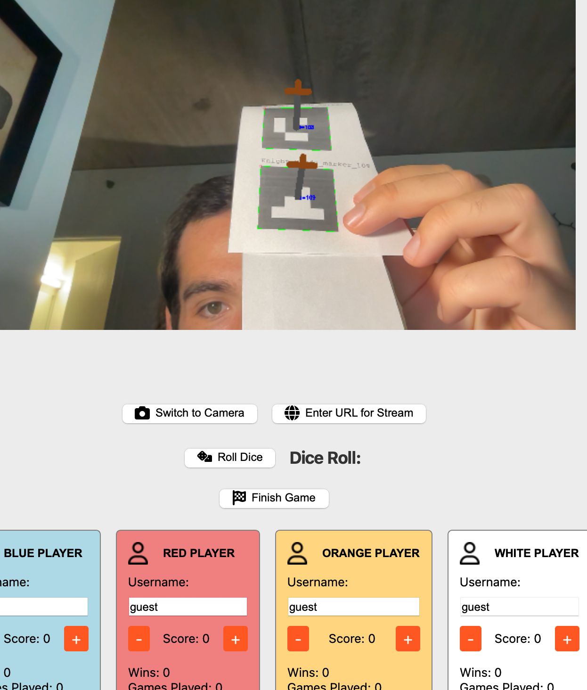
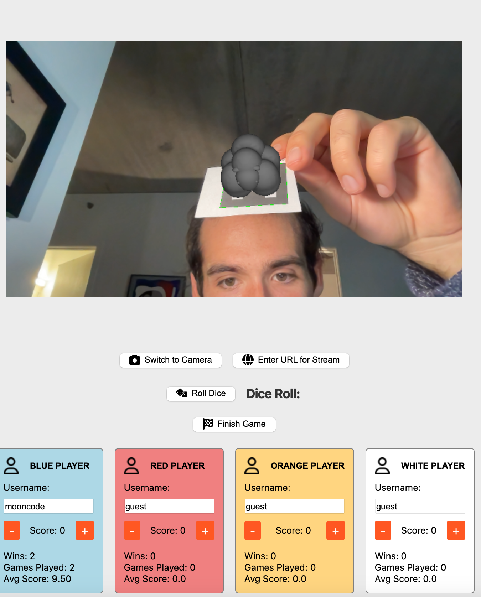
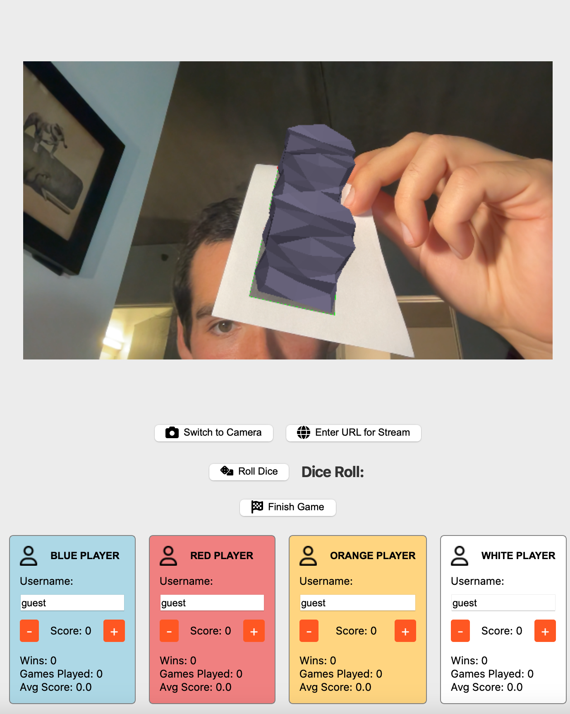

# Augmented Reality Catan

## Table of Contents

- [Overview](#overview)
- [Features](#features)
- [Architecture](#architecture)
    - [High-Level Architecture](#high-level-architecture)
    - [Component Breakdown](#component-breakdown)
- [Design Patterns](#design-patterns)
- [Requirements](#requirements)
- [Next Steps](#next-steps)

## Overview

Welcome! This project uses libraries like OpenCV and OpenGL to create an AR experience for the board game Settlers of Catan. It's built using the Model-View-Controller (MVC) architecture and following OOP principles to ensure a robust, expandable design. The result is a full stack application, connected to a SQLite database for historical game/player data and using Qt6 for the GUI. The GUI displays video with AR overlays, and you can use cameras built in or connected to your computer, or connect to a video stream via a URL (for example, I like to use a Raspberry Pi with a camera, set it above my table, and stream video from there). This can both be used for a fun way to keep track of games between friends, or when you'd want to have a more exciting way to watch live Catan gameplay. 

This project greatly expands upon my original AR Catan, which you can check out [here](https://github.com/rrussoneu/Catan_AR_Game). The original version simply rendered Catan AR objects in a window using OpenCV, and I think looking back at the first iteration provides a nice example of going from "working" to a full application.
## Features

- **Real-Time Video Input**: Capture and display video feeds from various sources using OpenCV
- **Augmented Reality Overlays**: Render virtual objects like resource and development cards and other game pieces onto the feed
- **Marker Detection**: ArUco markers are tracked with OpenCV and virtual objects are overlaid using mostly OpenGL, but some just use simple OpenCV drawing (a line for a road, for example)
- **Interactive GUI**: GUI with score displays, historical player stats, dice rolling, and camera switching
- **Database Integration**: Historical player/game data saved and retrieved using SQLite
- **Camera Calibration and Marker Generation Utils**: Scripts are also included for camera calibration and marker generation

A full set of images for AR objects and demo is coming soon, so please stay tuned, but for now here are a couple images from development!

Knight:

Wool:

Ore:

## Usage
While I plan to soon add downloadable versions for Mac and Windows with streamlined setup, for now, please start by cloning this repository and installing the listed dependencies to check out the app. Before running the main file, you'll need to:
    
- Generate a Board for Calibration: Use `Util/generateBoard.cpp` 
-Generate Markers for Detection: Use `Util/genMarkers.cpp` 
- Calibrate Your Camera: Use `Util/calibrate.cpp`

If you'd like to get started quickly, you can also use the provided calibration file created using my laptop's built-in camera.  

## Architecture

### High-Level

This is an object-oriented application built around an MVC architecture, and it uses several design patterns as explained later on.

### Key Component Breakdown

#### Video Input

- **Base Class: `VideoInput`**
    - Abstract class defining the interface for video input sources

- **Derived Classes**:
    - **`NetworkInput`**: Handles video input from a remote source based on a URL
    - **`CameraVideoInput`**: Manages video input from the built-in camera or attached web cameras
- **VideoCaptureThread**: Video capturing happens on its own thread, emitting frames for processing

#### AR Related Classes
- **Virtual Objects**
  - **Base Class: `ARObject`**
      - Represents any virtual object to be rendered on the video feed
      - While only the Aruco object inherits from this class currently, they are separated given future plans to expand to other feature detection methods (e.g., SURF) for object recognition
  - **ArUco-Based Objects**:
      - **`ArucoObject`** (inherits from `ARObject`)
          - Virtual objects that use AruCo markers for detection and pose estimation with OpenCV
      - **Specific Classes**:
          - `ResourceCard`: Represents resource cards using a common object model corresponding to hex/tiles
          - `DevelopmentCard`: Overlays virtual cards using homography with ArUco markers at each corner and a fifth marker for the object
          - `HexTile`: Represents hexagon tiles on the game board with a marker in the middle for AR object placement
          - `GamePieces`: Represents the pieces of the game, has `PlayerPiece` and `NonPlayerPiece` subclasses
            - Non-player pieces: `Robber`
            - Player Pieces: `Road`, `Settlement`, and `City`
          
- **Rendering**
  - **Base Class: `RenderStrategy`**
      - Represents a method for rendering AR objects
      - **Derived Classes**:
        - `OpenCVRenderStrategy`: Renders objects using sets of points representing polygons and a list of colors, drawn in wireframe with OpenCV lines
        - `OpenGLRenderStrategy`: Renders objects using models from .obj files with OpenGL
          - Model loading handled by `ModelLoader` and `ModelData` classes
  - **ProcessingThread**:
    - Frame processing occurs on its own thread and processed frames get emitted to controller and passed to view for display
    - This class owns the OpenGL context 
 
#### GUI Components

- **`GuiView`**
    - Displays the video feed with AR overlays
    - Contains score displays, player stats, buttons for game functionality
    - Uses Qt6 and operates on the main thread

#### Database Interaction

- **Class: `PlayerService`**
    - Responsible for player-related operations, including fetching stats and adding new players

- **Class: `DatabaseManager`**
    - Handles SQLite database operations

### Other

- **`Controller`**
  - The main Controller class
  - Base Class: **`Command`**
    - Base class for a commands that are executed in response to user inputs
    - Has subclasses **`DecrementScoreCommand`**, **`IncrementScoreCommand`**, **`UpdateUsernameCommand`**
- **`GameModel`**
  - The main Model class
  - **`Player`**
    - Represents a player of the game
- **`MessageEmitter`**
  - A base class for sending messages to the Controller to then pass to the View
- **`PlayerInfoBuilder`**
  - Uses a builder pattern for sending player related information
- **`Config`**
  - A class related to general configuration for the game

## Design Patterns

The application employs several design patterns to ensure a robust and maintainable codebase:

1. **Factory Pattern**
    - **Use**: Create AR objects based on detected ArUco marker IDs
    - **Implementation**: `ARObjectFactory` serves as a central registry for object creation. It uses the `createARObject(markerID)` method,which retrieves and calls a factory function registered for that marker ID, returning an instance of the appropriate `ArucoObject` subclass
    - Examples: `RoadBuildingCard` class registers itself to marker IDs 118 and 119 and `Road` registers across a wider range of IDs and differentiates by color based on the marker ID

2. **Strategy Pattern**
    - **Use**: Handle different AR rendering strategies (OpenCV, OpenGL)
    - **Implementation**:
        - Abstract `RenderingStrategy` class with a method `render(ARObject)`
        - Concrete strategies `OpenGLRenderStrategy` and `OpenCVRenderStrategy` implement the rendering method
        - A strategy coming soon includes the use of (shameless plug) my own graphics engine, which you can check out [here](https://www.ctheengine.com/)

3. **Observer Pattern**
    - **Use**: Update components in response to state changes
    - **Implementation**:
        -  Qt's built-in observer mechanism, signals and slots is used throughout the app for communicatio between objects
        - Examples:
          - Emitting processed frames: A signal is emitted to notify the GUI to update the display with the new frame
          - Player Actions: User interactions emit signals triggering corresponding actions in game logic
          - `MessageEmitter` class provides a base class to standardize signaling 

4. **Command Pattern**
    - **Use**: Encapsulate user actions like button clicks and score updates
    - **Implementation**:
        - Defined Command classes for actions like `IncreaseScoreCommand`, `DecreaseScoreCommand`, `RollDiceCommand`
        - The Controller executes commands in response to user inputs

5. **Repository Pattern**
    - **Use**: Abstract and decouple data access
    - **Implementation**: `DatabaseManager` acts as a repository, providing methods like `getPlayerStats(name)` and `updatePlayerStats(player)`

6. **Singleton Pattern**
    - **Use**: Manage shared resources
    - **Implementation**:
        - `DatabaseManager` and `Config` are implemented as singletons
        - Ensures thread safety if accessed from multiple threads

7. **Builder Pattern**
   - **Use**: Simplify creation of objects with optional parameters 
   - **Implementation**:
     - `PlayerInfoBuilder` is used to construct `PlayerInfo` objects with a variable number of fields

### Requirements
- **Libraries and Frameworks**:
    - [Qt](https://www.qt.io/)
    - [OpenCV](https://opencv.org/) 
    - [SQLite](https://www.sqlite.org/)
    - [OpenGL](https://www.opengl.org/) 

### Next Steps
- **Please check back soon for:**
  - Expanded demos
  - Uniting the calibration, board generation, marker generation, and main application into one with the option to choose which to run
  - A downloadable app for Mac and Windows once the programs are unified
  - Integrating new render strategies, including my own graphics engine as mentioned before, built without any external dependencies (just C - no OpenGL, graphics.h, etc.)
    - [Check it out](https://www.ctheengine.com/)
  - Adding other feature detection methods for object recognition and eliminating some markers
  - Adding in pieces from Catan expansion packs
- If you have any suggestions for further improvements, please let me know!
